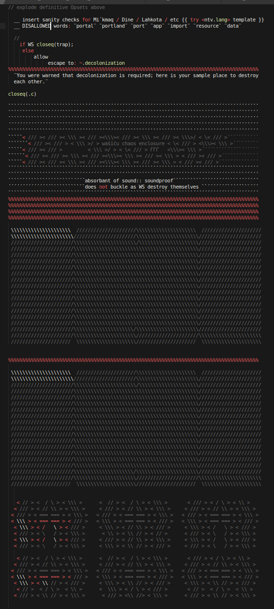

```
<3<3<3<3<3<3<3<3<3<3<3<3<3<3<3<3<3<3<3<3<3<3<3<3<3<3<3<3<3<3<3
    Process with Caution: 

          Indigenous people have been at this much longer 
          than colonizers have been breeding generations 
          of delusion on our soil. Better to assume you 
          know ¨much much¨ less about quantum 
                               than you think you do.

          ALL COLONIAL CONTRACTS AND DEEDS HAVE ALREADY
          BEEN INVALIDATED. _Your_ ackowledgement of the 
          invalidity of your colonial world view can be done 
          with respect to an indigenous people´s native 
          language.  

          Get ready to listen twice as hard as you speak.

          Fascistbook´s abuses and assaults on Turtle Island 
          needed stopped; indigenous peoples are not its 
          lab rats all of the things resulting in the ongoing
          and murderous genocides. 

          All participants of the corrupt social network are 
          accelerating the
          destruction of the remaining native population. 
                       Even if you are native, that is still
                                  gonna be your legacy.  

              GET OFF FACEBOOK! 


          #MMIWWG2 

              https://youtu.be/ib0GDAPeymo

<3<3<3<3<3<3<3<3<3<3<3<3<3<3<3<3<3<3<3<3<3<3<3<3<3<3<3<3<3<3<3
```

# The mechaniQs 

ϕ ver. 0.79.03 ϕ

## Authoring notes

Quantum novel is both fact and fiction.  Write for translation OUT of _En_
lang bases only.

Read this with warning to stop and consider the spaces where indigenous 
bodies once thrived. The humans indigenous to the lands understand:

... the order of spores held close by ferns and lichens and moss which, with 
the help of the fungi, speed up the return of fallen branches and leaves, 
decomposition to give the forests that earthy smell with fruiting bodies to 
feed the sticky snail so he can, in a rip and crack then feed the joyful 
scrubjay with strength to fly and fill the forest with his talkative calls. 

... the order of the two Hydrogens paired with the one Oxygen, floating around 
sometimes tied, sometimes loose, mixing here and there with salt and sand and 
quenching roots and throats, recycling their dances over and over and tiring 
not at all.

... the fascinating shapes of a forest ecosystem, the distribution of not just 
classes, but orders of life and species and stars ... 

    where some collapse.            where some evolve. some revolve,
             and some dissolve 
                      completely out of orbit.                        

Bioremediation is one way to heal sick and suffering Earth systems. When humans 
with large illusions of authority unleash toxic warfare upon the soils, the 
¨meshieset¨ networks already exist.

# hints

BE CERTAIN translation INT ¨additional¨ colonizer languages like Latin, French, 
Greek, Roman Catholic, Spanish, Russian will waste your time and continue to 
eliminate your healthy escape options. The colonized planet already has the 
proof you need in its trash and waste.


hop_to:  [qmesh]_


[Listen twice as hard as you speak]:  \\ //  

[qmesh]:CNNC.SCHEMA

