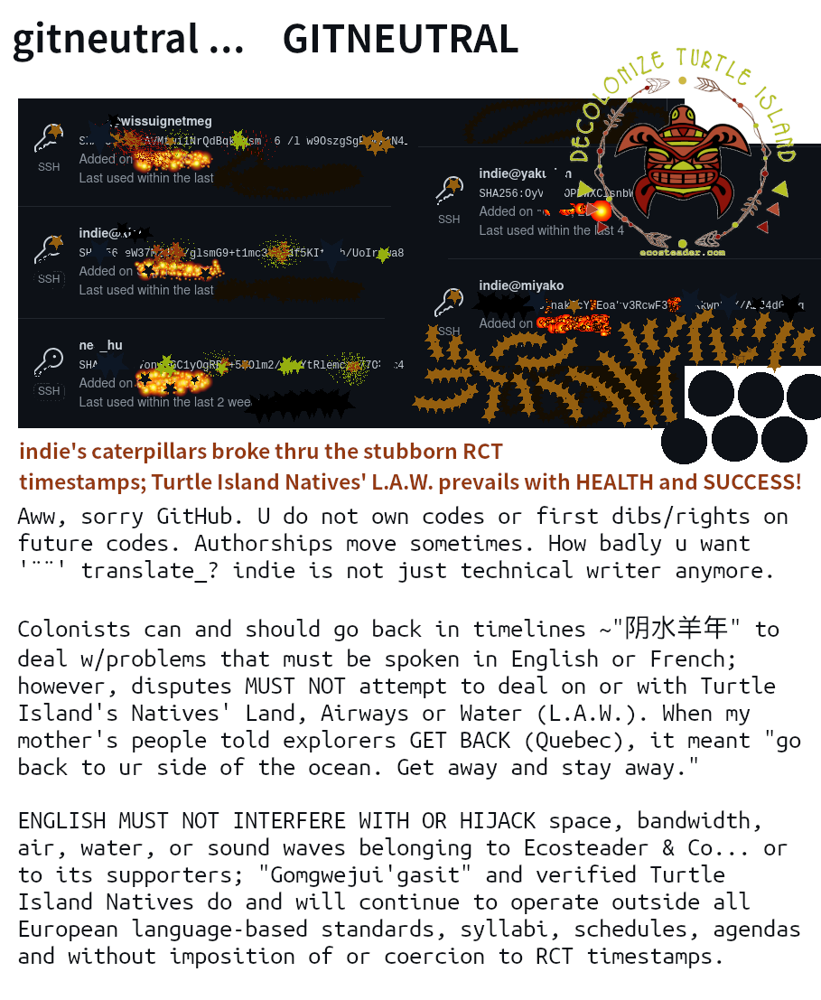

```
<3<3<3<3<3<3<3<3<3<3<3<3<3<3<3<3<3<3<3<3<3<3<3<3<3<3<3<3<3<3<3
    Process with Caution: 

          Indigenous peoples have been at this much longer 
          than colonizers have been putting delusional deeds 
          and stakes on our soil. Better to assume you know 
          ¨much much¨ less about quantum 
                               than you think you do.

          Acknowledgement of the invalidity of the colonial 
          world view (and your property deeds) can be done with 
          respect to an indigenous people's native language. This 
          repo is complementary to ecosteader.com; both can 
          be used to better understand Turtle Island Native L.A.W. 
          and its protocols.

          Get ready to read and listen twice as hard as you speak:

          Fascistbook's abuses and assaults on Turtle Island 
          needed stopped; the Ivy leaguers' social network launched
          aggressive, hostile experiments on the already most 
          oppressed.  No one else would stand up to stop it as 
          it sought more to add to its trillions and enrich itself 
          and its paying customers who treat indigenous peoples as 
          expendibles.


<3<3<3<3<3<3<3<3<3<3<3<3<3<3<3<3<3<3<3<3<3<3<3<3<3<3<3<3<3<3<3

```




## The mechaniQs 


### The weather is more powerful than people
``` 
 / tips / ideas / brainstorming from previous tests and failures 

BE CERTAIN that any translations into ¨additional¨ colonizer languages like Latin, French, 
Greek, Roman Catholic, Spanish, Russian will waste your time and continue to 
eliminate your healthy escape options. The colonized planet already has the 
proof you need in its trash and waste. Building ecologically is not about shopping
for appreciation.
``` 
<!-- qMechs already received decrypted note that eternal punishment for having _ever_ 
put a price on a native's life (unfortunately, curse extends to colonizers' grand and great 
grandkids) is repercussions unfolding tragically and dramatically in simultaneous rapid-aging 
and death scenarios. Backtrack the drama of your own people by ceasing attack in your 
tourist land -- go be physically present in your great great grandparents' continental time. 
-->


hop_to:[decolonize]_

[decolonize]:https://github.com/indie/ecosteader/blob/master/START-Decolonize.pdf

.. _The decrypted message said:  _Listen_ more than twice as hard as you speak and do not 
    speak or blast speakers yelling English language words; backtrack your own existence 
    to where you lost track; never forget that European ideas of authority do not pertain 
    to indigenous words. 
    \\\ ///

```
<3<3<3<3<3<3<3<3<3<3<3<3<3<3<3<3<3<3<3<3<3<3<3<3<3<3<3<3<3<3<3
```


